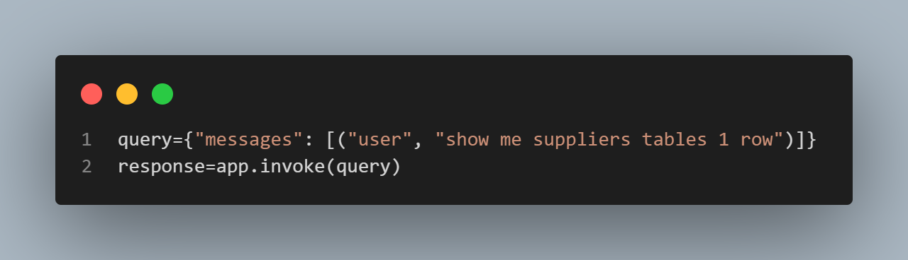

# SQL Conversational Agent with PostgreSQL

[](https://opensource.org/licenses/MIT)

A conversational AI agent that interacts with PostgreSQL databases using natural language, powered by LangChain and Groq's Llama3-70b model.

## Features

- Natural language to SQL conversion
- Automatic SQL query validation and error correction
- Database schema exploration
- Safe query execution with result interpretation
- Stateful conversation management
- Groq API integration for high-speed inference

## Prerequisites

- Python 3.9+
- PostgreSQL database
- Groq API key
- PostgreSQL credentials

## Installation

 Clone the repository:
```bash
git clone https://github.com/yourusername/your-repo-name.git
cd your-repo-name
## Project Structure
   .
   ├── README.md
   ├── app.py              # Web interface
   ├── zax.ipynb           # Main Jupyter notebook
   ├── requirements.txt    # Dependencies
   ├── .env.example        # Environment template
   └── schema.sql          # Database schema

1.Create and activate virtual environment
2.Install dependencies
3.Create .env file
4.Database setup:
   Create PostgreSQL database with 'your' schema
   Populate tables (refer to schema.sql)

## Usage
   Jupyter Notebook (zax.ipynb)

## Web Interface
   (app.py)

## Example Queries
   


##Key Components
Database Tools

    SQLDatabaseToolkit: Schema exploration and query execution
    Custom query validation and error handling
    Safe query execution wrapper

Language Model

    ChatGroq with Llama3-70b-8192 model
    Temperature: 0.0 for deterministic output

Workflow

    Schema inspection
    Query generation
    SQL validation
    Safe execution
    Result interpretation

API Reference

Tools
{
    "sql_db_list_tables": "List available tables",
    "sql_db_schema": "Get table schema",
    "sql_db_query": "Execute SQL query",
    "sql_db_query_checker": "Validate SQL queries"
}

State Graph

StateGraph(State)
    .add_node("first_tool_call", first_tool_call)
    .add_node("list_tables_tool", list_tables)
    .add_node("get_schema_tool", get_schema)
    ...
    .compile()

Acknowledgments

    LangChain for agent orchestration
    Groq for ultra-fast LLM inference
    PostgreSQL for reliable database management    

License

Distributed under the MIT License. See LICENSE for more information.    